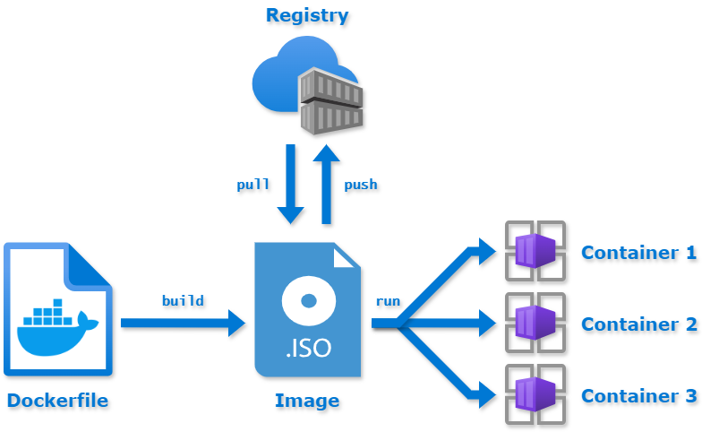

## Starting a container

:::warning

Make the distinction between a **docker image** and a **docker container**. We can see the docker
image as the template, containing a set of instructions, used for creating and running a container.
A docker container is the running instance of an image. This is similar to the distinction between
a program and a process (i.e. a process is a running instance of a program). You can read more
about this difference [here](https://aws.amazon.com/compare/the-difference-between-docker-images-and-containers/#:~:text=A%20Docker%20container%20is%20a%20self%2Dcontained%2C%20runnable%20software%20application,containers%20over%20an%20application's%20lifecycle.).

:::

In order to start a Docker container we use the following command:

```bash
cristian@cristianson:~/Desktop/ipw-docker$ docker run -it ubuntu:22.04 bash
Unable to find image 'ubuntu:22.04' locally
22.04: Pulling from library/ubuntu
3713021b0277: Already exists 
Digest: sha256:340d9b015b194dc6e2a13938944e0d016e57b9679963fdeb9ce021daac430221
Status: Downloaded newer image for ubuntu:22.04
root@78f701a0d391:/# ls
bin  boot  dev  etc  home  lib  lib32  lib64  libx32  media  mnt  opt  proc  root  run  sbin  srv  sys  tmp  usr  var
root@78f701a0d391:/# 
```

:::info

If the above command requires superuser privileges, (i.e. run with **sudo**), then follow these
[steps](https://docs.docker.com/engine/install/linux-postinstall/) to avoid prefixing every command
with **sudo**.

:::

Let's break down the arguments of the `docker` command:

- `run`, starts the container
- `-i`, the container is started in **interactive** mode, which means that it can accept keyboard
input
- `-t`, associates a terminal to the run command
- `ubuntu:22.04` is the name of the **image** : **version** we want to use. Keep in mind that if we
do not explicitly specify the version, than the latest image will be pulled from
[Dockerhub](https://hub.docker.com/)
- `bash`, the command we want to run in the container

:::info

Dockerhub is a public image repository that contains prebuilt images that we can download.

:::

If we want to see the local images we have downloaded from Dockerhub or created locally, we can do
`docker image ls`.

```bash

cristian@cristianson:~/Desktop/ipw-docker$ docker image ls
REPOSITORY          TAG       IMAGE ID       CREATED       SIZE
ubuntu              22.04     8a3cdc4d1ad3   4 weeks ago   77.9MB
ubuntu              latest    35a88802559d   7 weeks ago   78.1MB

```

:::tip

If you do not know what an argument does or what is the purpose of a command, use `man docker` or
 `docker help`.

:::

We can also run non-interactive commands in containers:

```bash
cristian@cristianson:~/Desktop/ipw-docker$ docker run ubuntu:22.04 ls
bin
boot
dev
etc
home
lib
lib32
lib64
libx32
media
mnt
opt
proc
root
run
sbin
srv
sys
tmp
usr
var
```

:::note

This time, the command just shows us the output of **ls** and the container exits immediately. This
is because we have run this command in the **foreground**.

:::

:::tip

Try to also run the `sleep 5` command and see what happens!

:::

Sometimes, however, running commands in the foreground is not ideal, especially if the command
takes a long time to run/output something. During that time, our terminal input is basically
blocked and we have to open another terminal tab if we want to do something else. This is why, when
we are required to run a command or a script that takes a long time, it is better to run the
command in the background.

In order to start a container in the background, we use the `-d` option for the `docker run`
command as follows:

```bash
cristian@cristianson:~/Desktop/ipw-docker$ docker run -d ubuntu:22.04 sleep 100
8b3d484ae9ad92f669d2780faaa1b1dc850922029391bf13a12de84014610758
cristian@cristianson:~/Desktop/ipw-docker$ docker ps
CONTAINER ID   IMAGE          COMMAND       CREATED         STATUS         PORTS     NAMES
8b3d484ae9ad   ubuntu:22.04   "sleep 100"   2 seconds ago   Up 2 seconds             distracted_sammet
```

The breakdown of the columns in the `docker ps` output are:

- `CONTAINER ID` - a unique id assigned by docker to each container.
- `IMAGE` - the name of the image that served as a template for this container
- `COMMAND` - the command we have issued when starting the container
- `PORTS` - ports the container exposes for communication with the outside world
- `NAMES` - a name which is randomly assigned by Docker

:::tip

You can change the name of the container when you are starting it. Do `docker run --help`, find the
option and then restart the ubuntu container with a new name! Do `docker ps` to see if the name
changed. Also, whenever you are in doubt about what a command is supposed to do or what options it
takes, the general form is `docker <command_name> --help` to list all of the available options.

:::

Observe the fact that this time the container did not exit, and is running in the background. The
container will stop after the provided command, in our case, `sleep 100`, finishes its execution.
Running `docker ps` after 100 seconds confirms this:

```bash

cristian@cristianson:~/Desktop/ipw-docker$ docker ps
CONTAINER ID   IMAGE     COMMAND   CREATED   STATUS    PORTS     NAMES

```

:::tip

Run the `docker ps` command after starting a container in the foreground! You need to open another
terminal tab in order to do this.

:::

After starting a container in the background using the `-d` option, we can also connect to it
interactively with the `docker exec` command.

```bash

cristian@cristianson:~/Desktop/ipw-docker$ docker run -d ubuntu:22.04 sleep 1000
48d58d5ab0a17c69dadcf5e3c6cfd8be519845cae3c67f41da19fe5ffc1f6382
cristian@cristianson:~/Desktop/ipw-docker$ docker ps
CONTAINER ID   IMAGE          COMMAND        CREATED          STATUS          PORTS     NAMES
48d58d5ab0a1   ubuntu:22.04   "sleep 1000"   11 seconds ago   Up 10 seconds             zen_hodgkin
cristian@cristianson:~/Desktop/ipw-docker$ docker exec -it 48d58d5ab0a1 /bin/bash
root@48d58d5ab0a1:/# ls
bin  boot  dev  etc  home  lib  lib32  lib64  libx32  media  mnt  opt  proc  root  run  sbin  srv  sys  tmp  usr  var
root@48d58d5ab0a1:/#

```

The format of the `docker exec` command is similar to that of `docker run`. We have used the `-it`
flags to start an interactive session with an attached terminal and we have chosen to run the
`/bin/bash` command. It is important to note that the container is uniquely identified via its
**ID** or assigned name in the **NAMES** column.

Now, we want to stop the running container because we its no fun to wait 1000 seconds to exit
automatically. In order to do this, we use the `docker stop` command with the container's **ID** or
**NAME**.

```bash

cristian@cristianson:~/Desktop/ipw-docker$ docker ps
CONTAINER ID   IMAGE          COMMAND        CREATED         STATUS         PORTS     NAMES
48d58d5ab0a1   ubuntu:22.04   "sleep 1000"   5 minutes ago   Up 5 minutes             zen_hodgkin
cristian@cristianson:~/Desktop/ipw-docker$ docker stop 48d58d5ab0a1
48d58d5ab0a1
cristian@cristianson:~/Desktop/ipw-docker$ docker ps
CONTAINER ID   IMAGE     COMMAND   CREATED   STATUS    PORTS     NAMES
cristian@cristianson:~/Desktop/ipw-docker$ docker ps -a
CONTAINER ID   IMAGE          COMMAND        CREATED         STATUS                       PORTS     NAMES
48d58d5ab0a1   ubuntu:22.04   "sleep 1000"   5 minutes ago   Exited (137) 3 seconds ago             zen_hodgkin
8b3d484ae9ad   ubuntu:22.04   "sleep 100"    24 hours ago    Exited (0) 24 hours ago                distracted_sammet
a236cc7b0efa   ubuntu:22.04   "sleep 5"      24 hours ago    Exited (0) 24 hours ago                hardcore_ritchie
94ef886a0e61   ubuntu:22.04   "sleep 1"      24 hours ago    Exited (0) 24 hours ago                serene_keller
c7591793567d   ubuntu:22.04   "ls"           24 hours ago    Exited (0) 24 hours ago                adoring_jang
d5cd0c63b9bb   ubuntu:22.04   "ps aux"       24 hours ago    Exited (0) 24 hours ago                condescending_mcclintock
f81e1edf1b36   ubuntu:22.04   "lsdir"        24 hours ago    Created                                condescending_wu
77fa7ff22c40   ubuntu:22.04   "ls"           24 hours ago    Exited (0) 24 hours ago                pedantic_lewin
707ae3470fe6   ubuntu:22.04   "ps -ef"       24 hours ago    Exited (0) 24 hours ago                exciting_heisenberg
cf3998b22236   ubuntu:22.04   "cat"          24 hours ago    Exited (0) 24 hours ago                bold_ritchie
78f701a0d391   ubuntu:22.04   "bash"         25 hours ago    Exited (130) 24 hours ago              unruffled_feistel
081fcd62be22   ubuntu         "bash"         25 hours ago    Exited (130) 25 hours ago              interesting_swanson
f65bb2661f94   ubuntu         "bash"         25 hours ago    Exited (130) 25 hours ago              friendly_liskov
5b7f19201652   alpine         "shell"        25 hours ago    Created                                youthful_roentgen
eb2c9ced368b   alpine         "bash"         25 hours ago    Created                                magical_satoshi
5b27ae6a1c47   alpine         "bash"         25 hours ago    Created                                epic_volhard
cristian@cristianson:~/Desktop/ipw-docker$

```

We can see that the container is no longer running. Sometimes the stop command takes a while, so
do not abort it. Also, if we pass the `-a` argument to the `docker stop` command, it will also list
the containers that were stopped. We can see that the first container, **zen_hodgkin** is the one
we stopped earlier.

## Exercise 1

- Start a container of your choice in background. Name it 'IPW-ROCKS'.
- Once started, connect to the container and install the `fzf` tool.
- Disconnect from the container.
- **NEW!** Try to pause and unpause the container. After each command, do a `docker ps`.
- Stop the container.
- **NEW** Completely remove the stopped container.

:::tip

You must start your container with a long running command or script, otherwise it will exit
immediately.

Also, **you are not allowed** to use Google to search how to do the pause/unpause/container removal.
💀 Use `docker help` and `grep` in order to find what you need. 😉
:::

## Let's create our own docker image

### Why would we want to create multiple images for multiple containers?

So far, we have used the containers interactively. Most of the times, however, this is not the case.
A container is a separate unit of computing with a well defined purpose. That is, it should do one
single thing, and do it well.

For example, we might have a web application with multiple components, and we have decided to split
encapsulate each component in its own docker container. That is:

- a database container
- a backend container
- a frontend container

Each of the above containers does one thing, and in the case of a backend or frontend change, the
rest of the containers remain unaffected and running. Even if one container crashes, we can easily
restart it without affecting the rest of the components.

### Building an image

The flow of building an image and deploying a container looks like this:



In order to create our custom container, we need to create a custom template, that is, a custom
docker image. To accomplish this, we will create a `Dockerfile`.

```text

FROM ubuntu:22.04

ARG DEBIAN_FRONTEND=noninteractive
ARG DEBCONF_NONINTERACTIVE_SEEN=true

ENV HELLO="hello"

RUN apt-get update
RUN apt-get install -y firefox

```

Let's break down each line of the above document:

- `FROM` - the first instruction in each Dockerfile, specifies the base container image, which means
that subsequent modifications will add/remove from this image.
- `ARG` - represents a variable that is available only when the container is built and can be
referenced throughout the Dockerfile.
- `ENV` - sets an environment variable that will be available in the resulting container at
runtime.
- `RUN` - runs a command when building the image. In this case, the resulting image will have
`firefox` pre-installed.

:::info

You can read more about the differences between **ARG** and **ENV**
[here](https://vsupalov.com/docker-arg-vs-env/).

:::

Once we have created the `Dockerfile`, we can build our image using the following command:
`docker build -t my-container .`

```bash

cristian@cristianson:~/Desktop/ipw-docker$ docker build -t my-container .
[+] Building 30.7s (7/7) FINISHED
[...]
 => exporting to image                                                                                                                                                                    1.0s 
 => => exporting layers                                                                                                                                                                   0.9s 
 => => writing image sha256:7493be1166b06d3521599a21c1ece1c5b4e2d438c3dacef0935e74d927aa875e                                                                                              0.0s 
 => => naming to docker.io/library/my-container

```

Let's break down the arguments to the `docker build` command:

- `-t` - specifies the tag of the image.
- **my-container** is the assigned tag.
- **.** - specifies that the Dockerfile is located in the current directory

:::note

In larger projects, we may have multiple Dockerfiles, each specifying the recipe for another image.
It is useful, then, to name them differently. However, by default, Docker recognizes only files
named `Dockerfile`. In order to have files named `Dockerfile.backend` or `Dockerfile.frontend` or
any other name we may come up with, we need to specify this to the `docker build` command via the
`-f` parameter. See `docker build --help` for more info.

:::

Now that we have built our image, let's run `docker image ls`:

```bash
cristian@cristianson:~/Desktop/ipw-docker$ docker image ls
REPOSITORY         TAG       IMAGE ID       CREATED          SIZE                                                
my-container       latest    7493be1166b0   13 minutes ago   369MB

```

This is the confirmation that the build was successful. Let's create a brand new container from this
image and verify if the environment variable has been correctly set up:

```bash

cristian@cristianson:~/Desktop/ipw-docker$ docker run -it my-container bash
root@40b9e8dae8f1:/# echo $HELLO
hello
root@40b9e8dae8f1:/# 

```

Nice! We did it. We could have also checked that the image had the HELLO environment variable set by
using the `docker image inspect` command.

```bash

cristian@cristianson:~/Desktop/ipw-docker$ docker image inspect my-container
[
    {
        "Id": "sha256:7493be1166b06d3521599a21c1ece1c5b4e2d438c3dacef0935e74d927aa875e",
        "RepoTags": [
            "my-container:latest"
        ],
        "RepoDigests": [],
        "Parent": "",
        "Comment": "buildkit.dockerfile.v0",
        "Created": "2024-08-01T13:51:50.003474082+03:00",
        "Container": "",
        "ContainerConfig": {
            "Hostname": "",
            "Domainname": "",
            "User": "",
            "AttachStdin": false,
            "AttachStdout": false,
            "AttachStderr": false,
            "Tty": false,
            "OpenStdin": false,
            "StdinOnce": false,
            "Env": null,
            "Cmd": null,
            "Image": "",
            "Volumes": null,
            "WorkingDir": "",
            "Entrypoint": null,
            "OnBuild": null,
            "Labels": null
        },
        "DockerVersion": "",
        "Author": "",
        "Config": {
            "Hostname": "",
            "Domainname": "",
            "User": "",
            "AttachStdin": false,
            "AttachStdout": false,
            "AttachStderr": false,
            "Tty": false,
            "OpenStdin": false,
            "StdinOnce": false,
            "Env": [
                "PATH=/usr/local/sbin:/usr/local/bin:/usr/sbin:/usr/bin:/sbin:/bin",
                "HELLO=hello"
            ],
            "Cmd": [
                "/bin/bash"
            ],
            "Image": "",
            "Volumes": null,
            "WorkingDir": "",
            "Entrypoint": null,
            "OnBuild": null,
            "Labels": {
                "org.opencontainers.image.ref.name": "ubuntu",
                "org.opencontainers.image.version": "22.04"
            }
        },
        "Architecture": "amd64",
        "Os": "linux",
        "Size": 369369133,
        "GraphDriver": {
            "Data": {
                "LowerDir": "/var/lib/docker/overlay2/p323vqywxcogfgl6sadeqwrsc/diff:/var/lib/docker/overlay2/372a31c779498a88a96829322ca93f496d0cf79a3a23f4c46b276f6670199ccc/diff",
                "MergedDir": "/var/lib/docker/overlay2/aakuflif4l5nqvh24azlltsw4/merged",
                "UpperDir": "/var/lib/docker/overlay2/aakuflif4l5nqvh24azlltsw4/diff",
                "WorkDir": "/var/lib/docker/overlay2/aakuflif4l5nqvh24azlltsw4/work"
            },
            "Name": "overlay2"
        },
        "RootFS": {
            "Type": "layers",
            "Layers": [
                "sha256:931b7ff0cb6f494b27d31a4cbec3efe62ac54676add9c7469560302f1541ecaf",
                "sha256:7b75401998b8840828c675a5956ab91e405aec86d363e76b4a0d645bb1a8414e",
                "sha256:c7e0e739bfbbcc8f59a777e8bb57b845ece9598a8a1df45833dc215104ad7dd1"
            ]
        },
        "Metadata": {
            "LastTagTime": "2024-08-01T13:51:50.961377181+03:00"
        }
    }
]

```

We can see that in the `Env` section we have our **HELLO** env variable.

:::info

Each Docker image is comprised of layers. Each command in the Dockerfile basically adds a new layer
that can be cached and later be used in other builds. Talking about the very inner workings of
Docker is beyond the scope of this workshop, but you can read more information here:

- [Docker storage driver](https://docs.docker.com/storage/storagedriver/)
- [Docker image optimization](https://cloudyuga.guru/blogs/understanding-docker-image-optimization-techniques-for-effective-deployment/#:~:text=Minimize%20The%20Number%20Of%20Layers,-In%20this%20technique&text=Each%20instruction%20like%20FROM%2C%20COPY,size%20of%20the%20resulting%20image.)
- [Number of docker layers](https://stackoverflow.com/questions/47079114/should-i-minimize-the-number-of-docker-layers)

:::

:::tip

With time, a system can accumulate lots of local images, containers and build caches. That means
that a user may end up with 0 space left on its laptop/PC. So, it is useful to see how much storage
Docker occupies. In order to do this, run the `docker system df` command. Ask one of the course
instructors for more details about the output and how you can free up disk space.

:::

## Exercise 2

- Write a `Dockerfile.image` file containing the instructions for generating a container image
based on `ubuntu`. The image should have the `24.04` version.
- **NEW** Create a file called `test.txt` in the same folder with `Dockerfile.image`. Copy this file
inside the container with some content inside.
- Set an environment variable called **MESSAGE** to whatever message you want.
- **NEW** Using `echo`, append the output of the environment variable to the copied file.
- Using a specific command, create the image such as, when running it non-interactively, it
outputs the contents of the file. Basically, add a default for executing the container.

:::tip

Have a look on the [Dockerfile reference](https://docs.docker.com/reference/dockerfile/) for the
required commands.

:::

docker networks?
docker volumes?
docker env/docker compose env variables

docker registries

## Docker networks


## Docker volumes